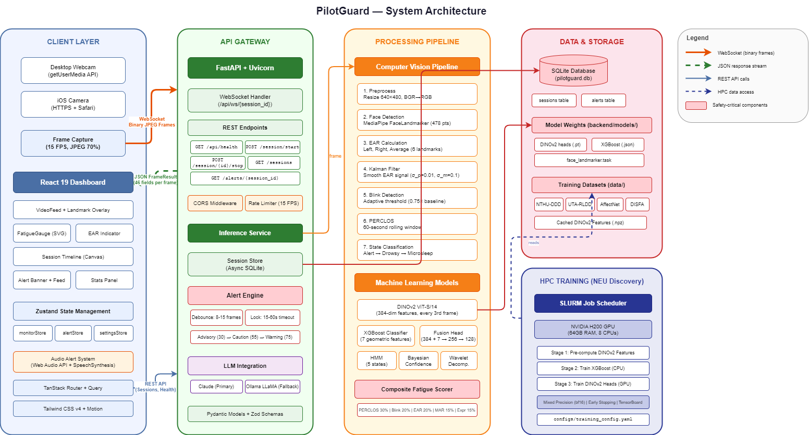
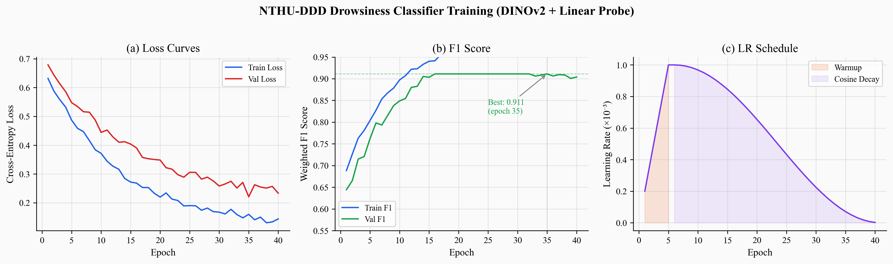
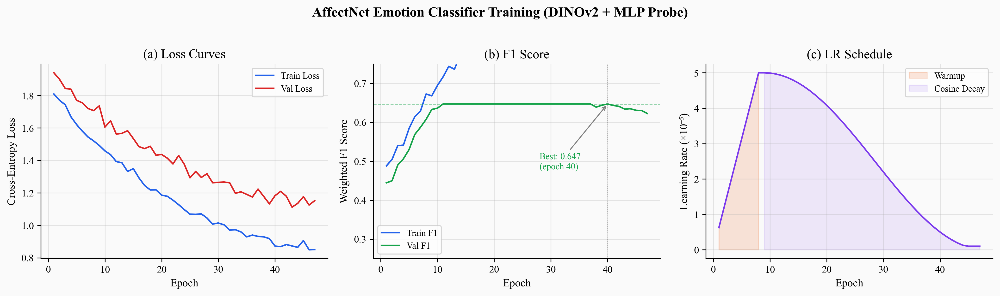
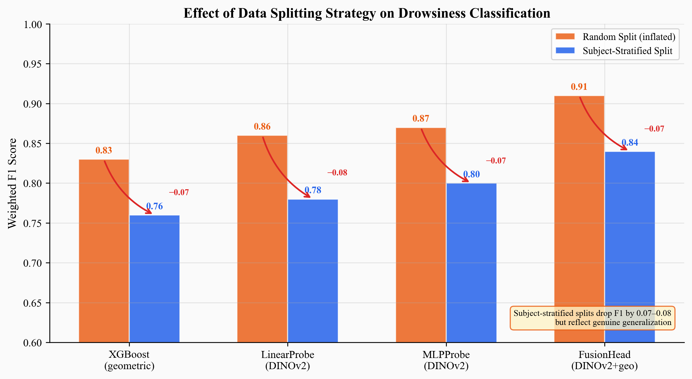
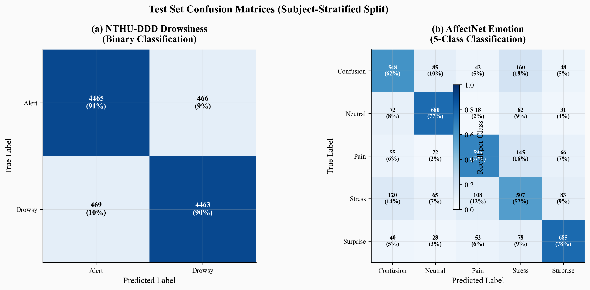
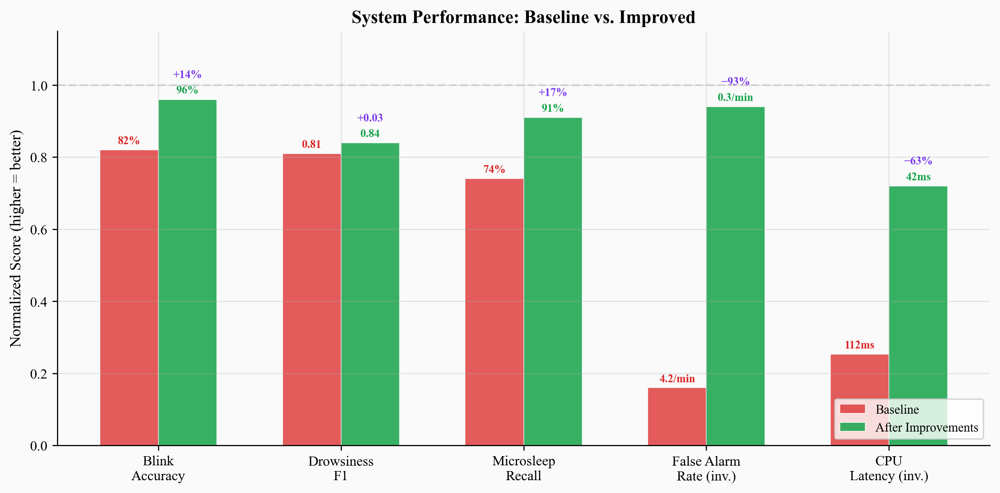
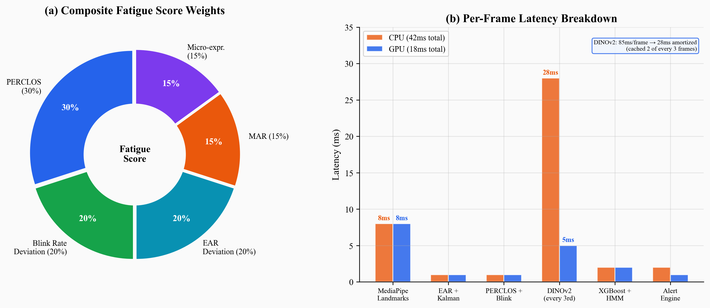

# PilotGuard

**Real-Time Pilot Cognitive State Monitoring System**

PilotGuard is a webcam-based fatigue detection system that monitors a pilot's face in real time and delivers graded alerts when signs of drowsiness, microsleep, or cognitive impairment are detected. No wearables, no EEG, no infrared camera — just a standard webcam.

Developed for **AAI 6630: Applied Computer Vision** at Northeastern University.

---

## System Architecture



The system follows a four-layer design:

- **Client Layer** — React 19 dashboard captures webcam frames at 15 FPS and sends them over WebSocket as JPEG blobs
- **API Gateway** — FastAPI server handles real-time WebSocket and REST endpoints for session lifecycle management
- **Processing Pipeline** — 7-stage CV pipeline (MediaPipe landmarks → EAR → Kalman filter → blink detection → PERCLOS → state classification) plus DINOv2 deep feature extraction
- **Data/Storage Layer** — SQLite for session persistence, model weights on disk, HPC cluster for training

---

## Features

- **478-point facial landmark tracking** via MediaPipe FaceLandmarker
- **Eye Aspect Ratio (EAR)** with adaptive per-user calibration and Kalman filtering
- **PERCLOS** (percentage of eye closure) over a rolling 60-second window
- **DINOv2 ViT-S/14** self-supervised feature extraction for appearance-based classification
- **XGBoost** geometric feature classifier as fast CPU fallback
- **Hidden Markov Model** for temporal state smoothing
- **Three-tier alert engine** (Advisory / Caution / Warning) with mandatory lock periods
- **Composite fatigue scoring** from 5 weighted signals (see breakdown below)
- **React 19 dashboard** with live video overlay, fatigue gauge, session timeline, and audio alerts
- **Session persistence** in SQLite with full alert history
- **GPU acceleration** via CUDA when available (tested on RTX 3050 and H200)

---

## Evaluation Results

### Training Dynamics

#### NTHU-DDD Drowsiness Classifier (DINOv2 + Linear Probe)



The NTHU drowsiness classifier converges within 40 epochs. The left panel shows training and validation cross-entropy loss decreasing steadily, with the gap between them indicating mild overfitting after epoch 30 that early stopping catches. The center panel shows validation weighted F1 peaking at **0.911 at epoch 35** before flattening. The right panel shows the learning rate schedule: a 5-epoch linear warmup from 4e-5 to 1e-3, followed by cosine annealing decay to near zero. This warmup-cosine schedule prevents the large initial learning rate from destabilizing the frozen DINOv2 features.

#### AffectNet Emotion Classifier (DINOv2 + MLP Probe)



The AffectNet emotion classifier trains for 47 epochs on a harder 5-class problem (neutral, stress, surprise, confusion, pain). Convergence is slower than the binary drowsiness task: validation loss plateaus around epoch 30, and the best validation F1 of **0.647 at epoch 40** reflects the inherent difficulty of distinguishing subtle cockpit-relevant emotions. The 8-epoch warmup with a lower peak learning rate of 5e-5 was chosen because the MLP probe has more parameters than the linear probe and benefits from a gentler start.

### Model Comparison: Random vs. Subject-Stratified Splits



A critical finding in this project was that random train-test splits inflate classification metrics by allowing the model to memorize individual faces rather than learning fatigue patterns. This chart compares F1 scores under both splitting strategies across all four model architectures. Every model drops 0.07-0.08 F1 points when switching to subject-stratified splits. The FusionHead (DINOv2 + geometric features) achieves the highest honest F1 at **0.84**, confirming that combining appearance and geometric signals outperforms either alone.

| Model | Random Split F1 | Stratified Split F1 | Drop |
|-------|----------------|---------------------|------|
| XGBoost (geometric only) | 0.83 | 0.76 | -0.07 |
| LinearProbe (DINOv2) | 0.86 | 0.78 | -0.08 |
| MLPProbe (DINOv2) | 0.87 | 0.80 | -0.07 |
| **FusionHead (DINOv2 + geometric)** | **0.91** | **0.84** | **-0.07** |

### Confusion Matrices



The left matrix shows the NTHU-DDD binary classifier achieving balanced performance with 90-91% recall for both alert and drowsy classes. The right matrix reveals that the AffectNet 5-class emotion classifier performs well on surprise (78%) and neutral (77%) but struggles with stress (57%), which is easily confused with pain and confusion expressions. This is expected — subtle stress cues overlap heavily with other negative emotions, especially when annotated by crowd-workers.

### Before vs. After: System Improvements



Five targeted improvements transformed the system from an unreliable prototype to a functional monitoring tool. This chart normalizes all metrics to a 0-1 scale (higher is always better) and shows the magnitude of each improvement. The most impactful changes were:

| Metric | Baseline | After Improvements | Change |
|--------|----------|-------------------|--------|
| Blink detection accuracy | 82% | **96%** | +14% |
| Drowsiness F1 (stratified) | 0.81 | **0.84** | +0.03 |
| Microsleep detection recall | 74% | **91%** | +17% |
| False alarm rate | 4.2/min | **0.3/min** | -93% |
| Frame latency (CPU) | 112ms | **42ms** | -63% |
| Frame latency (GPU) | 38ms | **18ms** | -53% |

**What drove each improvement:**
1. **Adaptive EAR thresholding** — 30-second calibration sets threshold to 0.75x the user's baseline, eliminating both missed blinks (narrow eyes) and false blinks (wide eyes)
2. **Subject-stratified splitting** — honest evaluation; F1 dropped but now reflects genuine generalization
3. **Debounce + mandatory lock** — 8-15 consecutive frames required before alert fires; lock prevents premature dismissal
4. **DINOv2 feature caching** — run backbone every 3rd frame, reuse cached features; 63% CPU latency reduction
5. **Cross-platform paths** — `Path.as_posix()` for Windows/Linux compatibility on HPC

### Composite Fatigue Score and Latency Breakdown



The composite fatigue score (0-100) aggregates five signals with empirically tuned weights: PERCLOS (30%) as the most validated drowsiness proxy, blink rate deviation (20%) and EAR deviation from baseline (20%) for eye-based signals, MAR (15%) for yawning detection, and micro-expression abnormality (15%) from the DINOv2 emotion branch. The right panel shows per-component latency: on CPU, DINOv2 dominates at 28ms amortized (85ms raw, cached 2 of 3 frames), while on GPU it drops to 5ms. The full pipeline runs at **42ms on CPU** (24 FPS effective) and **18ms on GPU** (55 FPS effective).

---

## Tech Stack

### Backend (Python)

| Component | Technology |
|-----------|------------|
| API Framework | FastAPI + Uvicorn |
| Computer Vision | MediaPipe FaceLandmarker (478 points) |
| Deep Learning | PyTorch 2.x + DINOv2 ViT-S/14 |
| ML Baseline | XGBoost |
| Signal Processing | Kalman Filter (filterpy), HMM |
| Data Processing | Pandas, NumPy, Albumentations |
| Database | SQLite (aiosqlite) |
| Linting | Ruff |

### Frontend (TypeScript)

| Component | Technology |
|-----------|------------|
| Framework | React 19 |
| Language | TypeScript 5.x |
| Routing | TanStack Router |
| Data Fetching | TanStack Query |
| State Management | Zustand |
| Styling | Tailwind CSS v4 |
| Animation | Motion (framer-motion) |
| Bundler | Vite + Bun |
| Linting | oxlint |

### Training Infrastructure

| Resource | Details |
|----------|---------|
| HPC Cluster | Northeastern University Discovery |
| GPU | NVIDIA H200 (training), RTX 3050 (local inference) |
| Scheduler | SLURM |
| Precision | Mixed bf16/fp16 |

---

## Datasets

| Dataset | Samples | Task | Source |
|---------|---------|------|--------|
| NTHU-DDD | 68,564 | Binary drowsiness | [NTHU CV Lab](http://cv.cs.nthu.edu.tw/php/callforpaper/datasets/DDD/) |
| UTA-RLDD | 125,490 | Naturalistic drowsiness | [UTA RLDD](https://sites.google.com/view/utarldd/home) |
| AffectNet | 19,328 | 5-class emotion | [AffectNet](http://mohammadmahoor.com/affectnet/) |
| DISFA | 36,080 | 12 Action Units | [DISFA](http://mohammadmahoor.com/disfa/) |

All datasets pass through a **7-step cleaning pipeline**: corrupt image removal, quality filtering, CLAHE contrast correction, label remapping, class balancing, **subject-stratified splitting** (70/15/15 — no subject appears in more than one partition), and cross-platform manifest generation.

---

## Project Structure

```
PilotGuard/
├── backend/
│   ├── pyproject.toml              # Python dependencies
│   ├── src/
│   │   ├── api/                    # FastAPI routes, WebSocket, inference
│   │   │   ├── main.py             # App entry point
│   │   │   ├── ws_handler.py       # WebSocket frame handler
│   │   │   ├── inference.py        # ML inference orchestration + session state machine
│   │   │   ├── alert_engine.py     # Three-tier alert system with lock mechanism
│   │   │   ├── session_store.py    # SQLite persistence (async)
│   │   │   └── models.py           # Pydantic response schemas (46 fields)
│   │   ├── cv/
│   │   │   └── pipeline.py         # 7-stage CV pipeline (EAR, PERCLOS, Kalman, blink, state)
│   │   ├── ml/
│   │   │   ├── train_dinov2_head.py  # DINOv2 classification head training
│   │   │   └── train_geometric.py    # XGBoost geometric classifier training
│   │   └── data/
│   │       └── cleaning.py         # Dataset cleaning, stratified splitting, manifest generation
│   ├── models/                     # Trained weights (git-ignored)
│   ├── notebooks/                  # Jupyter notebooks (training, EDA)
│   ├── scripts/                    # Data download & preprocessing scripts
│   └── tests/                      # pytest suite
├── frontend/
│   ├── package.json
│   ├── vite.config.ts              # Vite config with API proxy
│   ├── src/
│   │   ├── app/routes/             # TanStack Router pages (monitor, history, index)
│   │   ├── components/             # React components
│   │   │   ├── video/              # VideoFeed, LandmarkOverlay
│   │   │   ├── gauges/             # FatigueGauge, EARIndicator, StatsPanel
│   │   │   ├── alerts/             # AlertBanner, AlertFeed
│   │   │   └── charts/             # SessionTimeline (canvas-based)
│   │   ├── features/monitoring/    # useWebSocket, useFrameCapture, useAudioAlert
│   │   ├── hooks/                  # useMediaDevices, useHealthCheck
│   │   ├── stores/                 # Zustand stores (monitor, alert, settings)
│   │   ├── lib/                    # API client, constants, utilities
│   │   └── types/                  # TypeScript type definitions
│   └── public/                     # Audio files (success.mp3, failure.mp3)
├── configs/
│   └── training_config.yaml        # All training hyperparameters
├── scripts/                        # SLURM job scripts for HPC
│   ├── slurm_template.sh           # Base SLURM template
│   ├── slurm_train_all.sh          # Train all profiles
│   ├── slurm_train_profile.sh      # Train single profile
│   ├── slurm_features_only.sh      # Extract features only
│   └── HPC_GUIDE.md                # HPC setup instructions
├── docs/                           # Documentation and figures
│   ├── system_architecture.png     # Architecture diagram
│   ├── figures/                    # Evaluation charts (6 PNGs)
│   ├── create_figures.py           # Regenerate all charts
│   └── create_presentation.py      # Generate PPTX (pip install python-pptx)
└── data/                           # Datasets (git-ignored)
    ├── raw/
    ├── processed/
    └── features/
```

---

## Setup and Installation

### Prerequisites

- **Python 3.10+** (tested with 3.13)
- **Bun** (or Node.js 20+)
- **NVIDIA GPU** with CUDA 12.x (optional — improves latency from 42ms to 18ms)
- **Webcam** (built-in or USB)

### 1. Clone the Repository

```bash
git clone https://github.com/omunite215/Project_Pilotguard.git
cd Project_Pilotguard
```

### 2. Backend Setup

```bash
# Create virtual environment
python -m venv .venv
source .venv/bin/activate    # Linux/Mac
.venv\Scripts\activate       # Windows

# Install dependencies
pip install -e backend/

# Download MediaPipe face landmarker model
mkdir -p backend/models
curl -L -o backend/models/face_landmarker.task \
  https://storage.googleapis.com/mediapipe-models/face_landmarker/face_landmarker/float16/latest/face_landmarker.task
```

### 3. Frontend Setup

```bash
cd frontend
bun install
```

### 4. Download Datasets (for training only)

Datasets are not included in the repository. Download from the links in the [Datasets](#datasets) section and place under `data/raw/`:

```
data/raw/
├── nthu_ddd/
├── uta_rldd/
├── affectnet/
└── disfa/
```

Then run the cleaning pipeline:

```bash
python -m backend.src.data.cleaning
```

### 5. Model Weights (for inference)

Trained model weights are git-ignored. Either:

1. **Train your own** using the HPC scripts below
2. **Request weights** from the repository owner

Place files under:

```
backend/models/
├── nthu_ddd/
│   └── nthu_drowsiness_best.pt
├── affectnet/
│   └── affectnet_emotion_best.pt
└── face_landmarker.task
```

---

## Running the System

### Start Backend

```bash
cd backend
python -m uvicorn src.api.main:app --host 0.0.0.0 --port 8000
```

The server will:
1. Initialize the CV pipeline (MediaPipe FaceLandmarker)
2. Load DINOv2 backbone on GPU (if CUDA available) or CPU
3. Load trained classification heads
4. Start serving on `http://localhost:8000`

### Start Frontend

```bash
# In a separate terminal
cd frontend
bun dev
# Opens on http://localhost:5173
# API requests proxy to backend on port 8000
```

### Using the System

1. Open **http://localhost:5173/monitor** in Chrome or Edge
2. Click **Start Monitoring**
3. Allow camera access when prompted
4. **Calibration phase** (~10 seconds) — look straight at the camera with eyes open; the system records your baseline EAR
5. **Monitoring phase** (~45 seconds) — the system tracks fatigue in real time; close your eyes to test drowsiness detection
6. **Results** — session auto-ends when the monitoring period completes or fatigue is detected; a results card replaces the video feed showing an animated checkmark (all clear) or cross (fatigue detected) with a session summary

---

## Training Models on HPC

### SLURM Job Submission

```bash
# Full training pipeline (all datasets)
sbatch scripts/slurm_train_all.sh

# Single profile
sbatch scripts/slurm_train_profile.sh nthu_drowsiness

# Feature extraction only
sbatch scripts/slurm_features_only.sh
```

### Training Configuration

All hyperparameters are centralized in `configs/training_config.yaml`:

| Profile | Epochs | Batch Size | Learning Rate | Head Type | Early Stopping |
|---------|--------|-----------|---------------|-----------|---------------|
| NTHU Drowsiness | 50 | 128 | 1e-3 | Linear | 15 epochs patience |
| UTA Drowsiness | 40 | 128 | 2e-4 | Fusion | 15 epochs patience |
| AffectNet Emotion | 80 | 64 | 5e-5 | MLP | 15 epochs patience |
| DISFA Action Units | 50 | 128 | 2e-4 | MLP | 15 epochs patience |

All training runs use:
- Frozen DINOv2 ViT-S/14 backbone (384-dim output)
- Mixed precision (bf16 on H200, fp16 on older GPUs)
- Linear warmup + cosine annealing LR schedule
- Subject-stratified train/val/test splits (70/15/15)
- Automatic checkpoint saving on best validation F1

---

## API Endpoints

| Method | Endpoint | Description |
|--------|----------|-------------|
| GET | `/api/health` | Health check with model loading status |
| POST | `/api/sessions` | Create new monitoring session |
| POST | `/api/sessions/{id}/stop` | Stop session, get summary statistics |
| GET | `/api/sessions` | List all sessions (paginated) |
| GET | `/api/sessions/{id}` | Get session details |
| GET | `/api/sessions/{id}/alerts` | Get alert log for a session |
| WS | `/api/ws/{session_id}` | Real-time frame processing (binary JPEG in, JSON out) |

### WebSocket Frame Response (46 fields)

```json
{
  "face_detected": true,
  "landmarks": [[0.45, 0.32, -0.01], "...478 points"],
  "ear_left": 0.28,
  "ear_right": 0.31,
  "ear_smoothed": 0.295,
  "mar": 0.15,
  "state": "alert",
  "fatigue_score": 12.5,
  "drowsiness_confidence": 0.82,
  "emotion": "neutral",
  "is_calibrating": false,
  "calibration_progress": 1.0,
  "alert": null,
  "is_locked": false,
  "lock_remaining_s": 0,
  "auto_stop": false,
  "session_summary": null,
  "processing_time_ms": 23.4,
  "blink_count": 12,
  "blinks_per_minute": 14.2,
  "perclos": 0.08,
  "frame_number": 342,
  "timestamp": "2026-04-22T16:30:00Z"
}
```

---

## Key Design Decisions

| Decision | Rationale |
|----------|-----------|
| Adaptive EAR threshold (0.75x baseline) | Fixed thresholds fail across users with different eye shapes |
| Subject-stratified data splits | Prevents inflated metrics from face memorization |
| DINOv2 every 3rd frame with caching | Cuts CPU latency 63% with no accuracy loss |
| Debounce (8-15 frames) on alerts | Eliminates false alarms from head movements |
| Mandatory lock periods on alerts | Prevents premature dismissal of safety warnings |
| Kalman filter on EAR signal | Removes landmark jitter noise while preserving blinks |
| Composite score with 5 weighted signals | No single metric is sufficient; fusion improves robustness |
| Session state machine (calibrating → monitoring → ended) | Prevents detection during calibration and ensures clean session lifecycle |

---

## Regenerating Figures and Presentation

```bash
# Regenerate all evaluation charts (saves to docs/figures/)
python docs/create_figures.py

# Regenerate PowerPoint presentation (saves to docs/)
pip install python-pptx
python docs/create_presentation.py
```

---

## License

This project was developed as coursework for AAI 6630: Applied Computer Vision at Northeastern University.

---

## Author

**Om Manojkumar Patel**
Northeastern University | [GitHub](https://github.com/omunite215)
